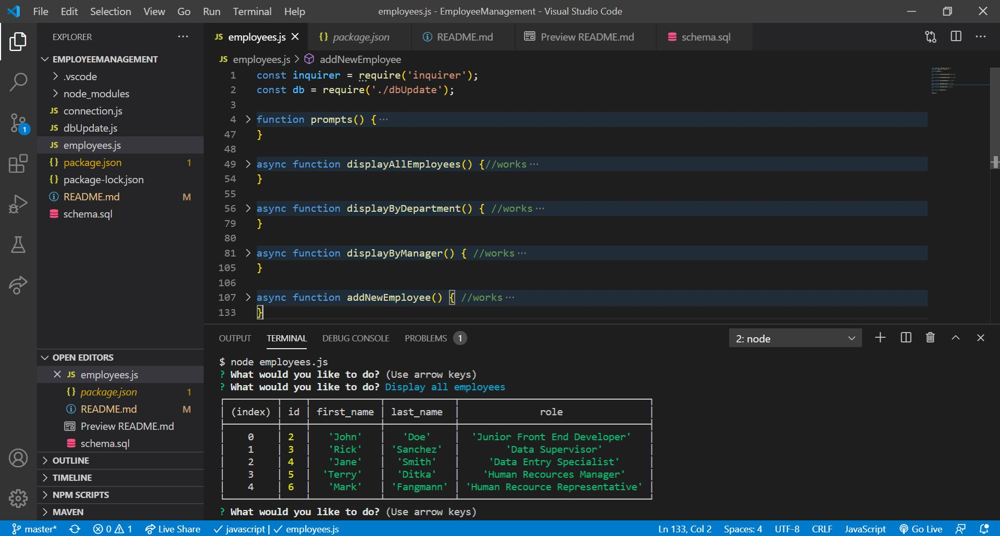

# EMPLOYEE MANAGEMENT

## Description

    In this application the user will be able to manage their team. This includes viewing the information for all employees, removing employees, creating new departments and much more.
    The app accomplishes this by updating a database called "employee" in mySQL and returns the results in the terminal via Node.js.

## Installation

    initialize npm: npm init -y 

    install inquirer: npm i inquirer
    install mysql: npm i mysql

## Features

    - Users can create new employees
    - Update an employee's role
    - View employees by manager, department, or role

## Technologies

    * JavaScript
    * MySQL
    * Node
    * Inquirer

## Contributors
    Michael Cervantes

